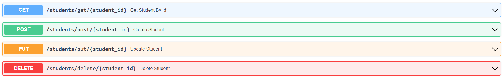

# FastAPI Practice



A simple implementation of FastAPI in Python using CRUD operations.

## Details

- Developing based on the tutorial [FastAPI Course for Beginners](https://www.youtube.com/watch?v=tLKKmouUams) on the [freeCodeCamp YouTube Channel](https://www.youtube.com/channel/UC8butISFwT-Wl7EV0hUK0BQ) by [Code With Tomi](https://www.youtube.com/c/CodeWithTomi).
- Understanding how to use CRUD operations with a "classroom" of students using [FastAPI](https://fastapi.tiangolo.com/) in [Python](https://www.python.org/).
- Uses [Uvicorn](https://www.uvicorn.org/) as the "lightning fast ASGI server implementation."

## Built With

- [FastAPI](https://fastapi.tiangolo.com/)
- [Uvicorn](https://www.uvicorn.org/)
- [Python](https://www.python.org/)

## How to Use

1. Fork the repository.
2. Clone the repository to your local environment using the terminal command ```git clone https://github.com/<YOUR_USERNAME>/fastapi-practice.git```
3. ```cd``` into your cloned folder
4. Initialize your virtual environment with ```python -m venv venv```
5. Activate your virtual environment
   1. Windows: ```venv\Scripts\activate```
   2. Git Bash: ```source venv\\Scripts\\activate```
6. Install all local packages from the requirements.txt using ```pip install -r requirements.txt```
7. Run the local uvicorn server with ```uvicorn myapi:app --reload```, where "myapi" is your .py filename.
8. Check out your local api server! Normally it's at ```https://localhost:8000```, and you can check an interactive docs at ```https://localhost:8000/docs```

Want to learn more about how to work with FastAPI? Check out the [links in the Details section](#details).

## Contributors

<a
    href="https://github.com/rzmk/fastapi-practice/graphs/contributors">
  
</a>

## Contact

Mueez Khan - [@rzmk](https://github.com/rzmk)

Project Link: [https://github.com/rzmk/fastapi-practice](https://github.com/rzmk/fastapi-practice)
